# Proyecto Implantación y Administración de un LMS Corporativo

**Alumno:** Jorge Noguera Jirón  
**Empresa:** CodeArts Solutions    
**Plataforma LMS:** Moodle  
**Servidor:** Ubuntu Server  
**Hipervisor:** VMware Workstation 17 Pro  

---

## Descripción del proyecto

Este proyecto consiste en el despliegue completo de una infraestructura LMS corporativa basada en Moodle, realizado íntegramente de forma manual sobre Ubuntu Server virtualizado con VMware Workstation 17 Pro.

El objetivo principal no es únicamente instalar Moodle, sino comprender cómo se despliega, organiza, administra y protege una infraestructura real basada en servicios Linux dentro de un entorno corporativo.

---

## Índice de retos

| Nº | Reto | Estado |
|---|---|---|
| 01 | [Preparación del entorno de virtualización corporativo](#reto-01--preparación-del-entorno-de-virtualización-corporativo) | ✅ Completado |
| 02 | [Despliegue y configuración inicial del servidor Ubuntu Server](#reto-02--despliegue-y-configuración-inicial-del-servidor-ubuntu-server) | ✅ Completado |
| 03 | [Implementación de recurso compartido corporativo mediante Samba](#reto-03--implementación-de-recurso-compartido-corporativo-mediante-samba) | ✅ Completado |
| 04 | [Implantación del servidor web Apache](#reto-04--implantación-del-servidor-web-apache) | ✅ Completado |
| 05 | [Instalación del entorno PHP para la plataforma LMS](#reto-05--instalación-del-entorno-php-para-la-plataforma-lms) | ✅ Completado |
| 06 | [Implantación y securización inicial de MariaDB](#reto-06--implantación-y-securización-inicial-de-mariadb) |✅ Completado |
| 07 | [Creación y configuración de la base de datos corporativa del LMS](#reto-07--creación-y-configuración-de-la-base-de-datos-corporativa-del-lms) | ✅ Completado|
| 08 | [Configuración de resolución de nombres local para el LMS corporativo](#reto-08--configuración-de-resolución-de-nombres-local-para-el-lms-corporativo) | ✅ Completado |
| 09 | [Despliegue y preparación de la estructura del LMS corporativo](#reto-09--despliegue-y-preparación-de-la-estructura-del-lms-corporativo) | ✅ Completado |
| 10 | [Instalación lógica y configuración inicial de Moodle](#reto-10--instalación-lógica-y-configuración-inicial-de-moodle) | ✅ Completado |
| 11 | [Administración inicial y configuración corporativa del LMS](#reto-11--administración-inicial-y-configuración-corporativa-del-lms) | ✅ Completado|
| 12 | [Gestión corporativa de usuarios, roles y permisos en Moodle](#reto-12--gestión-corporativa-de-usuarios-roles-y-permisos-en-moodle) | ⏳ Pendiente |
| 13 | [Creación y organización del entorno formativo corporativo](#reto-13--creación-y-organización-del-entorno-formativo-corporativo) | ⏳ Pendiente |
| 14 | [Hardening y buenas prácticas básicas de seguridad del servidor LMS](#reto-14--hardening-y-buenas-prácticas-básicas-de-seguridad-del-servidor-lms) | ⏳ Pendiente |
| 15 | [Implementación de estrategia básica de copias de seguridad del LMS corporativo](#reto-15--implementación-de-estrategia-básica-de-copias-de-seguridad-del-lms-corporativo) | ⏳ Pendiente |

---

## Reto 01 — Preparación del entorno de virtualización corporativo

### Introducción

En este primer reto preparo el entorno de virtualización que utilizaré durante todo el proyecto. VMware Workstation 17 Pro actúa como hipervisor de tipo 2 sobre el equipo anfitrión, permitiéndome crear y gestionar la máquina virtual donde desplegaré el servidor Ubuntu que alojará Moodle. Antes de crear ninguna VM, verifico que el sistema es capaz de virtualizar y que el hipervisor está correctamente instalado.

### Objetivos

- Instalar VMware Workstation 17 Pro en el equipo anfitrión.
- Confirmar que el procesador soporta virtualización por hardware.
- Verificar que el hipervisor arranca y funciona correctamente.
- Reconocer las opciones principales del entorno: creación de VMs, hardware virtual, instantáneas, redes y almacenamiento.
- Definir los recursos que necesitará la VM del servidor Moodle.

### Material utilizado

| Elemento | Detalle |
|---|---|
| Equipo anfitrión | PC con Windows 10/11 (64 bits) |
| Software | VMware Workstation 17 Pro |
| Requisitos mínimos | CPU con VT-x/AMD-V, 8 GB RAM recomendados, 50 GB libres en disco |

### Desarrollo

#### Verificar que el procesador soporta virtualización

Antes de instalar VMware compruebo que mi CPU tiene activada la virtualización por hardware desde el Administrador de tareas (`Ctrl + Shift + Esc`) → pestaña **Rendimiento → CPU**, donde debe aparecer **Virtualización: Habilitada**.

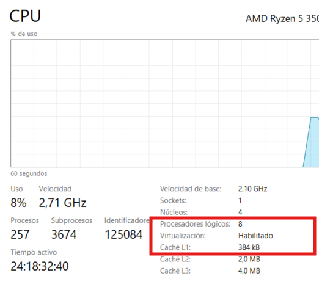  
*Figura 1 — Virtualización habilitada en el procesador del equipo anfitrión.*

#### Instalar VMware Workstation 17 Pro

Descargo el instalador desde la web oficial de VMware/Broadcom y lo ejecuto como administrador. Sigo el asistente aceptando la licencia, dejando la ruta por defecto y activando el **Enhanced Keyboard Driver** para mejorar la compatibilidad con el teclado dentro de las VMs.

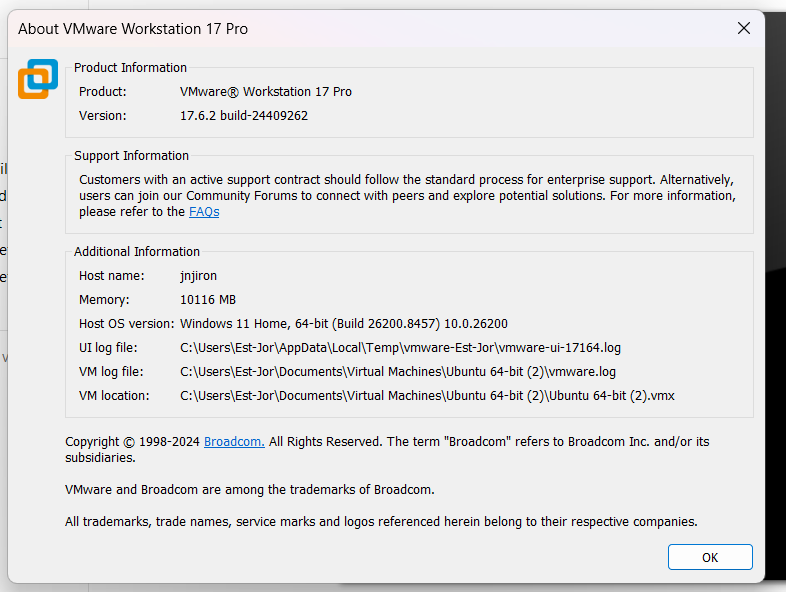  
*Figura 2 — Instalación de VMware Workstation 17 Pro completada.*

#### Verificar que VMware arranca correctamente

Abro VMware Workstation 17 Pro desde el escritorio y compruebo que se muestra la pantalla principal sin errores, con las opciones de creación y gestión de máquinas virtuales disponibles.

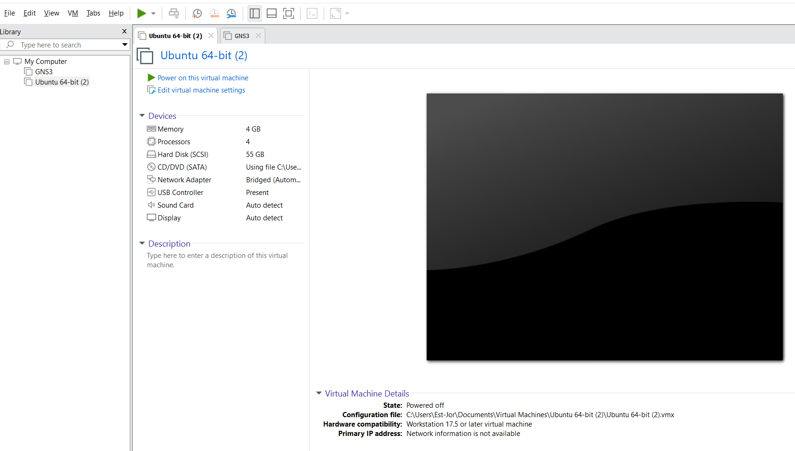  
*Figura 3 — Pantalla principal del hipervisor VMware Workstation 17 Pro.*

#### Explorar el menú de creación de máquinas virtuales

Accedo al asistente de creación de nueva VM (`Ctrl + N`) y observo las opciones disponibles: **Typical** para una configuración guiada simplificada y **Custom (Advanced)** para control total del hardware virtual.

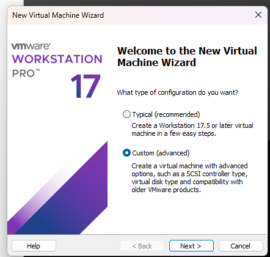  
*Figura 4 — Menú de creación de máquinas virtuales en VMware.*

#### Revisar las opciones de red virtual

Accedo a **Edit → Virtual Network Editor** y reviso los tres tipos de red disponibles:

| Tipo | Nombre | Función |
|---|---|---|
| Bridged | VMnet0 | La VM se conecta directamente a la red física del host |
| NAT | VMnet8 | La VM accede a Internet usando la IP del host |
| Host-only | VMnet1 | La VM solo se comunica con el host, sin acceso externo |

Para el servidor Moodle utilizaré **NAT** durante la instalación para tener acceso a Internet y descargar paquetes.

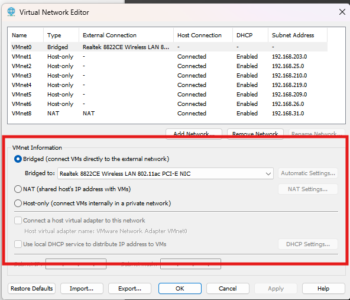  
*Figura 5 — Opciones de red virtual disponibles en VMware.*

### Explicación técnica

**Función de la virtualización en el proyecto:**  
VMware Workstation actúa como hipervisor de tipo 2, ejecutándose sobre el sistema operativo del equipo anfitrión. Su función es crear una máquina virtual aislada donde instalaré Ubuntu Server, que a su vez alojará todos los servicios del LMS Moodle (Apache, PHP, MariaDB). Gracias a la virtualización, simulo un servidor real completo sin necesidad de hardware dedicado, manteniendo el entorno del proyecto separado del sistema operativo principal.

**Por qué es útil usar máquinas virtuales en administración de sistemas:**  
Las máquinas virtuales permiten desplegar y destruir entornos de prueba rápidamente sin afectar al equipo físico. Las instantáneas permiten guardar el estado del servidor antes de realizar cambios críticos, facilitando revertir errores. El aislamiento entre host y VM mejora la seguridad, y la portabilidad de los archivos `.vmdk` permite mover o clonar el servidor completo fácilmente.

### Comprobaciones finales

- [x] VMware 17 Pro instalado y abre sin errores.
- [x] Administrador de tareas muestra **Virtualización: Habilitada**.
- [x] Pantalla principal del hipervisor visible.
- [x] Asistente de creación de VM explorado.
- [x] Virtual Network Editor abierto y tipos de red identificados.

---

## Reto 02 — Despliegue y configuración inicial del servidor Ubuntu Server

### Introducción

En este reto creo y configuro la máquina virtual que actuará como servidor base de todo el proyecto. Sobre ella instalo Ubuntu Server, establezco una IP estática mediante Netplan y habilito el acceso remoto por SSH. Al finalizar, el servidor queda completamente operativo y listo para recibir los servicios de Moodle en los retos siguientes.

### Objetivos

- Crear la VM en VMware con los recursos adecuados para un LMS pequeño.
- Instalar Ubuntu Server configurando hostname, usuario y red.
- Asignar una IP estática al servidor mediante Netplan.
- Habilitar y verificar el acceso remoto por SSH.
- Confirmar conectividad desde el equipo anfitrión.

### Material utilizado

| Elemento | Detalle |
|---|---|
| Hipervisor | VMware Workstation 17 Pro |
| SO invitado | Ubuntu Server 22.04 LTS |
| RAM | 4 GB |
| CPU | 2 núcleos |
| Disco | 40 GB |
| Red | Adaptador puente (Bridge) |
| Equipo anfitrión | Windows 10/11 |

### Desarrollo

#### Descarga de la ISO de Ubuntu Server

Accedo a [https://ubuntu.com/download/server](https://ubuntu.com/download/server) y descargo la imagen **Ubuntu Server 22.04 LTS**. La guardo en una ubicación accesible desde el equipo anfitrión.

#### Creación de la máquina virtual en VMware

En VMware creo una nueva VM en modo **Custom (Advanced)** con los siguientes recursos:

| Recurso | Configuración |
|---|---|
| RAM | 4096 MB (4 GB) |
| CPU | 2 núcleos |
| Disco | 40 GB (SCSI) |
| Red | Bridged (adaptador puente) |

Asigno el nombre `moodle-server` a la VM, asocio la ISO de Ubuntu Server descargada y arranco la instalación.

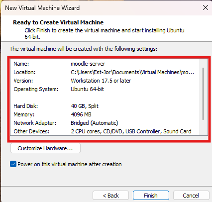

*Figura 1 — Configuración de hardware de la máquina virtual.*

#### Instalación de Ubuntu Server

Durante el proceso de instalación realizo las siguientes configuraciones:

- **Idioma y teclado** según la región.
- **Tipo de instalación:** Ubuntu Server estándar.
- **Hostname:** `moodle-server`.
- **Usuario administrador:** nombre de usuario y contraseña definidos para el proyecto.
- **OpenSSH:** marcada la casilla de instalación automática ✅.
- **Snaps adicionales:** ninguno — los servicios se instalan manualmente en retos posteriores.

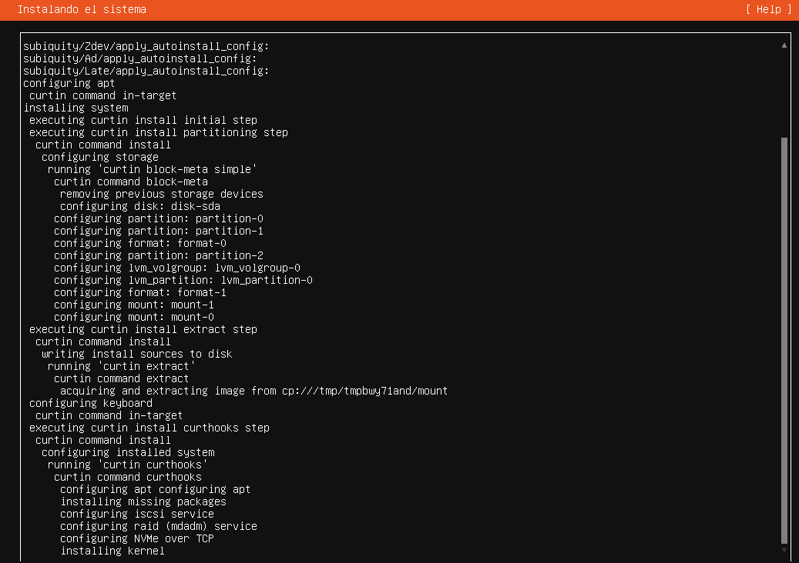

*Figura 2 — Configuración del hostname durante la instalación.*

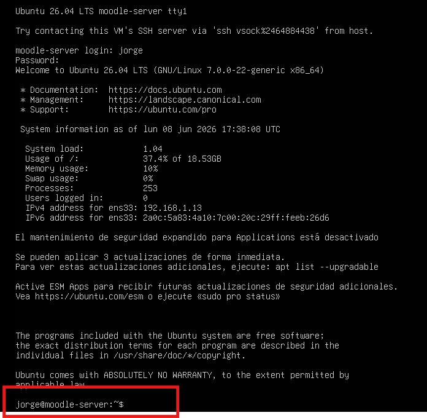

*Figura 3 — Ubuntu Server instalado y primer acceso por consola.*

#### Configuración de IP estática con Netplan

Ubuntu Server gestiona la red mediante **Netplan**. Identifico primero el nombre de la interfaz con `ip a` y edito el archivo de configuración:

```bash
sudo nano /etc/netplan/00-installer-config.yaml
```

```yaml
network:
  version: 2
  renderer: networkd
  ethernets:
    ens33:
      dhcp4: no
      addresses:
        - 192.168.1.100/24
      routes:
        - to: default
          via: 192.168.1.1
      nameservers:
        addresses: [8.8.8.8, 1.1.1.1]
```

Aplico la configuración:

```bash
sudo netplan apply
```

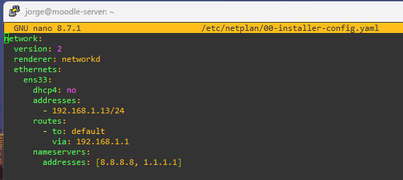

*Figura 4 — Configuración de IP estática mediante Netplan.*

#### Verificación de la IP estática

Compruebo que la IP estática ha sido aplicada correctamente:

```bash
ip a
```

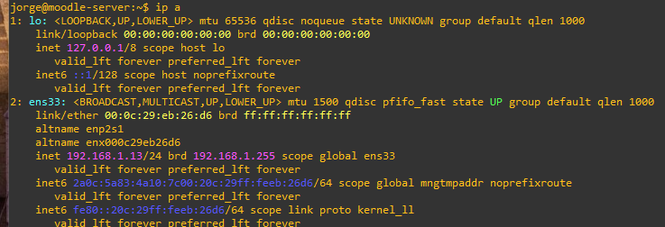

*Figura 5 — IP estática configurada y visible con `ip a`.*

#### Verificación de conectividad a Internet

Desde el servidor compruebo conectividad al exterior y resolución de nombres:

```bash
ping -c 4 8.8.8.8
ping -c 4 google.com
```

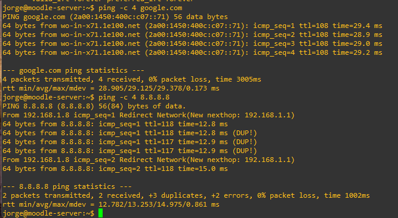

*Figura 6 — Prueba de conectividad a Internet desde el servidor.*

#### Acceso remoto por SSH desde el equipo anfitrión

Desde PowerShell en el equipo anfitrión me conecto al servidor:

```bash
ssh jorge@192.168.1.100
```

La conexión se establece correctamente, confirmando que OpenSSH está operativo y el servidor es administrable de forma remota.

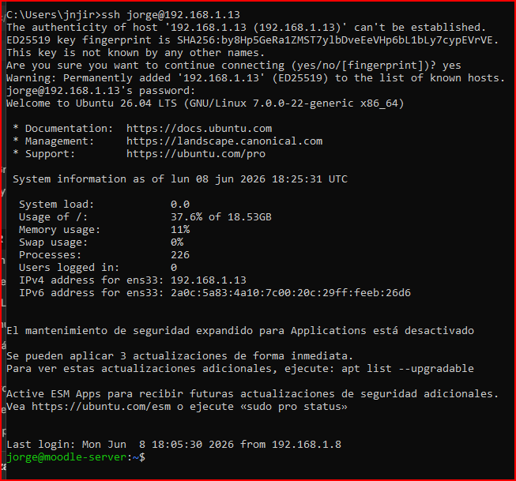

*Figura 7 — Acceso remoto al servidor mediante SSH desde el equipo anfitrión.*

### Comprobaciones finales

- [x] VM creada con 4 GB RAM, 2 núcleos, 40 GB disco y red Bridge.
- [x] Ubuntu Server instalado con hostname `moodle-server`.
- [x] Usuario administrador creado.
- [x] IP estática configurada y visible con `ip a`.
- [x] Ping al exterior responde correctamente.
- [x] OpenSSH operativo y acceso remoto verificado desde el host.

---

## Reto 03 — Implementación de recurso compartido corporativo mediante Samba

### Introducción

En este reto habilito un recurso compartido en red dentro del servidor Ubuntu Server utilizando Samba, un servicio que permite compartir carpetas entre sistemas Linux, Windows y macOS dentro de la misma red local. El recurso `codearts-share` servirá como punto de intercambio de archivos entre el servidor y el equipo anfitrión durante todo el proyecto.

### Objetivos

- Instalar y configurar el servicio Samba en Ubuntu Server.
- Crear la carpeta corporativa `/srv/codearts-share` con los permisos adecuados.
- Publicar el recurso compartido con el nombre `codearts-share`.
- Verificar que el servicio está activo y el recurso es accesible desde Windows.

### Material utilizado

| Elemento | Detalle |
|---|---|
| Servidor | Ubuntu Server 22.04 LTS |
| IP del servidor | 192.168.1.13 |
| Servicio | Samba |
| Carpeta compartida | `/srv/codearts-share` |
| Nombre del recurso | `codearts-share` |
| Acceso desde | Windows (equipo anfitrión) |

### Desarrollo

#### Actualización del sistema e instalación de Samba

Actualizo los repositorios del sistema antes de instalar cualquier servicio:

```bash
sudo apt update && sudo apt upgrade -y
```

Instalo el paquete de Samba:

```bash
sudo apt install samba -y
```

Verifico que la instalación se ha completado correctamente comprobando la versión del demonio instalado:

```bash
smbd --version
```

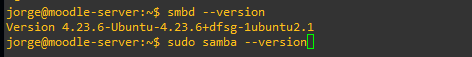

*Figura 1 — Instalación de Samba en Ubuntu Server.*

#### Creación de la carpeta compartida corporativa

Creo el directorio obligatorio del proyecto en la ruta indicada:

```bash
sudo mkdir -p /srv/codearts-share
```

Asigno el propietario y los permisos necesarios para que el usuario pueda leer y escribir dentro de la carpeta:

```bash
sudo chown -R jorge:jorge /srv/codearts-share
sudo chmod 777 /srv/codearts-share
```

Verifico que la carpeta existe con los permisos correctos:

```bash
ls -ld /srv/codearts-share
```

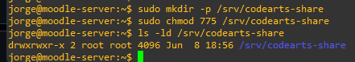

*Figura 2 — Creación de la carpeta `/srv/codearts-share` con permisos correctos.*

#### Configuración de Samba

Realizo una copia de seguridad del archivo de configuración original antes de modificarlo:

```bash
sudo cp /etc/samba/smb.conf /etc/samba/smb.conf.bak
```

Edito el archivo de configuración y añado el bloque del recurso compartido al final:

```bash
sudo nano /etc/samba/smb.conf
```

```ini
[codearts-share]
   path = /srv/codearts-share
   browseable = yes
   read only = no
   guest ok = no
   valid users = jorge
   force user = jorge
   create mask = 0664
   directory mask = 0775
```

Verifico que la sintaxis del archivo es correcta:

```bash
testparm
```

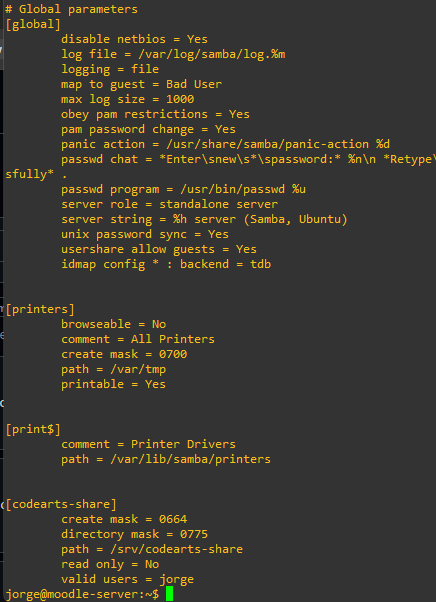

*Figura 3 — Configuración del recurso compartido en `smb.conf`.*

#### Registro del usuario Samba y apertura del firewall

Registro el usuario `jorge` en el sistema de contraseñas de Samba y lo activo:

```bash
sudo smbpasswd -a jorge
sudo smbpasswd -e jorge
```

Permito el tráfico de Samba a través del firewall:

```bash
sudo ufw allow samba
sudo ufw status
```

#### Reinicio y verificación del servicio Samba

Reinicio los servicios de Samba para aplicar la configuración y compruebo que están activos:

```bash
sudo systemctl restart smbd nmbd
sudo systemctl status smbd
```

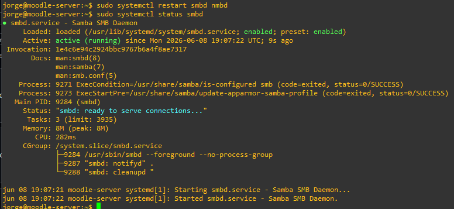

*Figura 4 — Servicio Samba activo y en ejecución.*

#### Acceso al recurso compartido desde Windows

Desde el equipo anfitrión Windows abro el Explorador de archivos e introduzco en la barra de direcciones:

```
\\192.168.1.13\codearts-share
```

Introduzco las credenciales del usuario Samba cuando se solicitan. La carpeta compartida se abre correctamente.

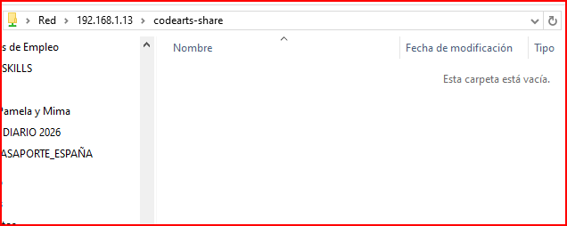

*Figura 5 — Acceso al recurso compartido desde el equipo anfitrión Windows.*

#### Prueba de escritura en el recurso compartido

Creo un archivo de prueba desde Windows dentro de la carpeta compartida y verifico desde el servidor que ha aparecido correctamente:

```bash
ls -l /srv/codearts-share
```

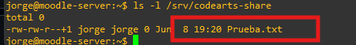

*Figura 6 — Archivo de prueba creado desde Windows visible en el servidor.*

### Comprobaciones finales

- [x] Samba instalado correctamente en Ubuntu Server.
- [x] Carpeta `/srv/codearts-share` creada con propietario y permisos adecuados.
- [x] Bloque `[codearts-share]` añadido a `smb.conf` sin errores de sintaxis.
- [x] Usuario Samba registrado y activo.
- [x] Firewall permite tráfico Samba.
- [x] Servicio `smbd` activo y en ejecución.
- [x] Recurso accesible desde Windows mediante `\\192.168.1.13\codearts-share`.
- [x] Escritura de archivos verificada desde ambos extremos.

---

## Reto 04 — Implantación del servidor web Apache

### Introducción

En este reto instalo Apache en el servidor Ubuntu, que será el componente encargado de servir las páginas web del LMS Moodle a los usuarios de la red local. Antes de instalar Moodle o cualquier otro servicio, verifico que Apache responde correctamente a peticiones HTTP en el puerto 80 desde el equipo anfitrión, dejando así la base web de la infraestructura preparada para los retos siguientes.

### Objetivos

- Instalar el servidor web Apache2 en Ubuntu Server.
- Configurar el arranque automático del servicio.
- Abrir el puerto 80 en el firewall.
- Validar que Apache está activo y escuchando en el puerto 80.
- Comprobar el acceso HTTP desde el navegador del equipo anfitrión.

### Material utilizado

| Elemento | Detalle |
|---|---|
| Servidor | Ubuntu Server 22.04 LTS |
| IP del servidor | 192.168.1.13 |
| Servicio | Apache2 |
| Puerto | 80 (HTTP) |
| Acceso desde | Navegador del equipo anfitrión Windows |

### Desarrollo

#### Instalación de Apache2

Actualizo los repositorios e instalo Apache:

```bash
sudo apt update && sudo apt install apache2 -y
```

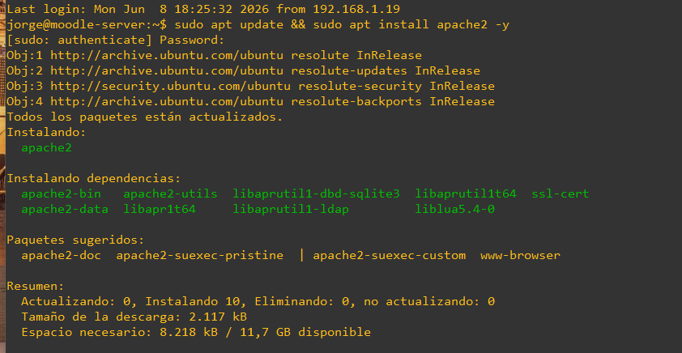

*Figura 1 — Instalación de Apache2 en Ubuntu Server.*

#### Habilitación del arranque automático y apertura del firewall

Configuro Apache para que se inicie automáticamente con el sistema:

```bash
sudo systemctl enable apache2
```

Permito el tráfico HTTP en el firewall:

```bash
sudo ufw allow 'Apache'
sudo ufw status
```

#### Verificación del estado del servicio

Compruebo que Apache está activo y en ejecución:

```bash
sudo systemctl status apache2
```

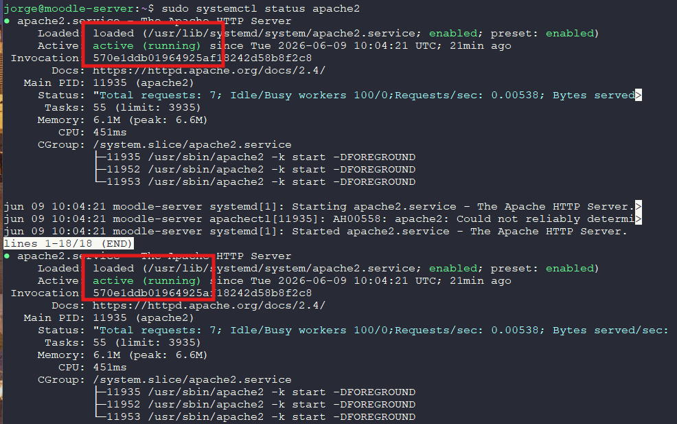

*Figura 2 — Servicio Apache2 activo y en ejecución.*

#### Validación del puerto 80 y respuesta local

Verifico que Apache está escuchando correctamente en el puerto 80 y que el servidor responde localmente:

```bash
sudo ss -tlnp | grep 80
curl -I http://localhost
```

La respuesta incluye `HTTP/1.1 200 OK`, confirmando que Apache devuelve contenido correctamente.

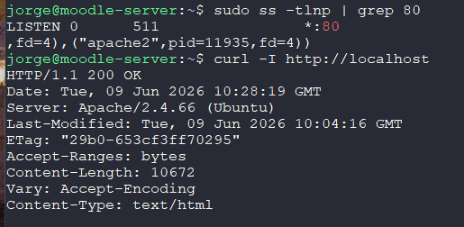

*Figura 3 — Validación del puerto 80 y respuesta HTTP del servidor.*

#### Acceso desde el navegador del equipo anfitrión

Desde el equipo anfitrión Windows accedo mediante el navegador a:

```
http://192.168.1.13
```

Se carga la página por defecto de Apache con el mensaje **"Apache2 Ubuntu Default Page"**, confirmando que el servidor web es accesible desde la red local.

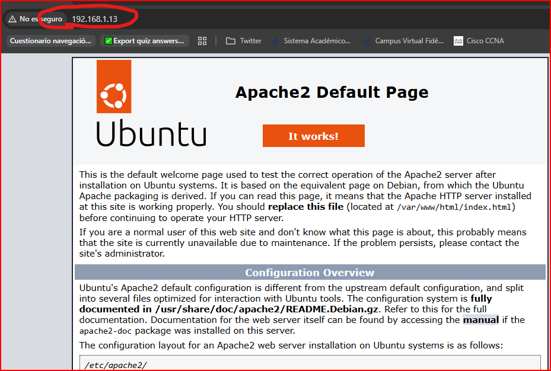

*Figura 4 — Página por defecto de Apache2 accesible desde el equipo anfitrión.*

### Comprobaciones finales

- [x] Apache2 instalado correctamente.
- [x] Servicio configurado para arranque automático con `systemctl enable`.
- [x] Puerto 80 abierto en el firewall UFW.
- [x] `systemctl status apache2` muestra **active (running)**.
- [x] Puerto 80 escuchando verificado con `ss -tlnp`.
- [x] Respuesta `200 OK` confirmada con `curl` desde el servidor.
- [x] Página por defecto de Apache visible desde el navegador del anfitrión.

---

## Reto 05 — Instalación del entorno PHP para la plataforma LMS

### Introducción

Moodle es una aplicación web desarrollada en PHP, por lo que el servidor necesita un intérprete PHP completamente funcional e integrado con Apache. En este reto instalo PHP junto con todas las extensiones que Moodle requiere para funcionar correctamente, y verifico que Apache es capaz de procesar archivos PHP mediante una página de prueba visible desde el navegador.

### Objetivos

- Instalar PHP y los módulos necesarios para Moodle en Ubuntu Server.
- Verificar la versión instalada de PHP.
- Confirmar la integración correcta entre Apache y PHP.
- Crear y validar un archivo de prueba `info.php` desde el navegador.

### Material utilizado

| Elemento | Detalle |
|---|---|
| Servidor | Ubuntu Server 22.04 LTS |
| IP del servidor | 192.168.1.13 |
| Lenguaje | PHP 8.x |
| Servidor web | Apache2 |
| Directorio web | `/var/www/html/` |

### Desarrollo

#### Instalación de PHP y módulos requeridos por Moodle

Actualizo los repositorios e instalo PHP junto con todas las extensiones que Moodle necesita. El módulo OPcache viene incluido dentro del paquete principal de PHP en Ubuntu y no requiere instalación separada:

```bash
sudo apt update && sudo apt install php libapache2-mod-php php-mysql php-xml php-mbstring php-curl php-zip php-gd php-intl php-soap php-cli -y
```

Estas extensiones cubren los requisitos de Moodle 4.x:

| Módulo | Función en Moodle |
|---|---|
| `libapache2-mod-php` | Integración de PHP con Apache |
| `php-mysql` | Conexión con la base de datos MariaDB |
| `php-xml` | Procesamiento de XML y RSS |
| `php-mbstring` | Soporte de caracteres multibyte y UTF-8 |
| `php-curl` | Peticiones HTTP externas |
| `php-zip` | Gestión de archivos comprimidos |
| `php-gd` | Procesamiento de imágenes |
| `php-intl` | Internacionalización y localización |
| `php-soap` | Servicios web SOAP |
| `OPcache` | Incluido en el paquete PHP base — caché de código para mejor rendimiento |

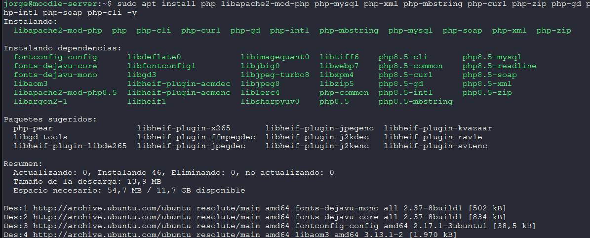

*Figura 1 — Instalación de PHP y módulos requeridos por Moodle.*

#### Verificación de la versión instalada de PHP

Compruebo que PHP se ha instalado correctamente y verifico la versión disponible:

```bash
php --version
```

Verifico también que OPcache está cargado correctamente:

```bash
php -m | grep -i opcache
```

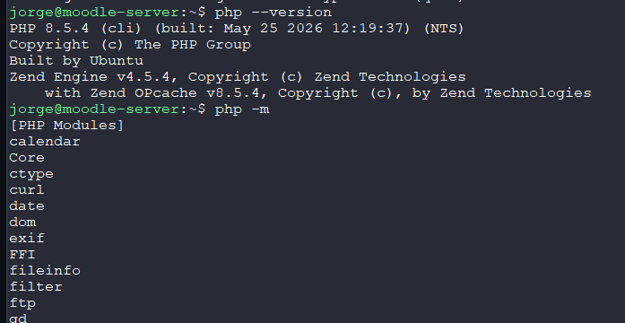

*Figura 2 — Versión de PHP instalada en el servidor.*

#### Reinicio de Apache tras la integración con PHP

Reinicio Apache para que cargue el módulo PHP correctamente y compruebo que el servicio sigue activo:

```bash
sudo systemctl restart apache2
sudo systemctl status apache2
```

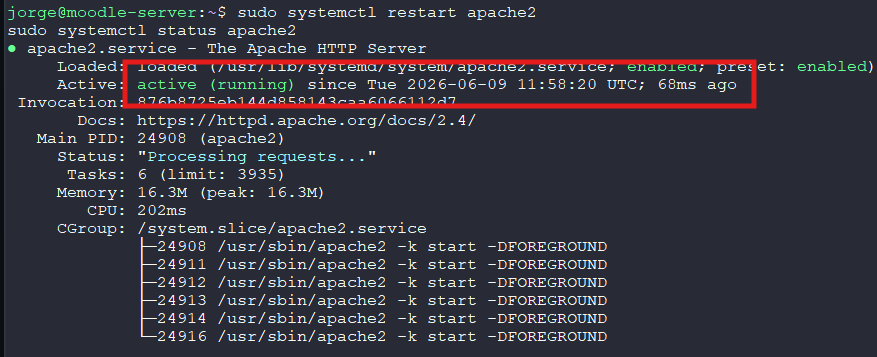

*Figura 3 — Estado de Apache2 tras la integración con PHP.*

#### Creación del archivo de prueba phpinfo

Creo un archivo PHP dentro del directorio web de Apache para verificar que el servidor procesa PHP correctamente:

```bash
sudo nano /var/www/html/info.php
```

Contenido del archivo:

```php
<?php
phpinfo();
?>
```

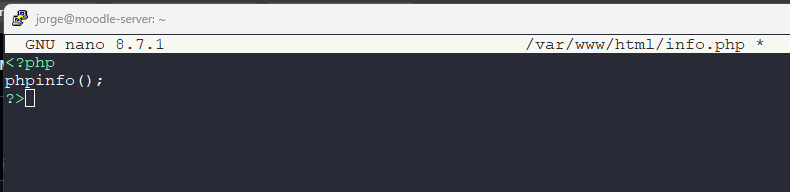

*Figura 4 — Archivo de prueba `info.php` creado en el directorio web.*

#### Validación del entorno PHP desde el navegador

Desde el equipo anfitrión Windows accedo mediante el navegador a:

```
http://192.168.1.13/info.php
```

Se carga la página de información de PHP con todos los módulos instalados, la versión y la integración con Apache, confirmando que el servidor procesa correctamente archivos PHP. Una vez validado, elimino el archivo por seguridad ya que expone información sensible del servidor:

```bash
sudo rm /var/www/html/info.php
```

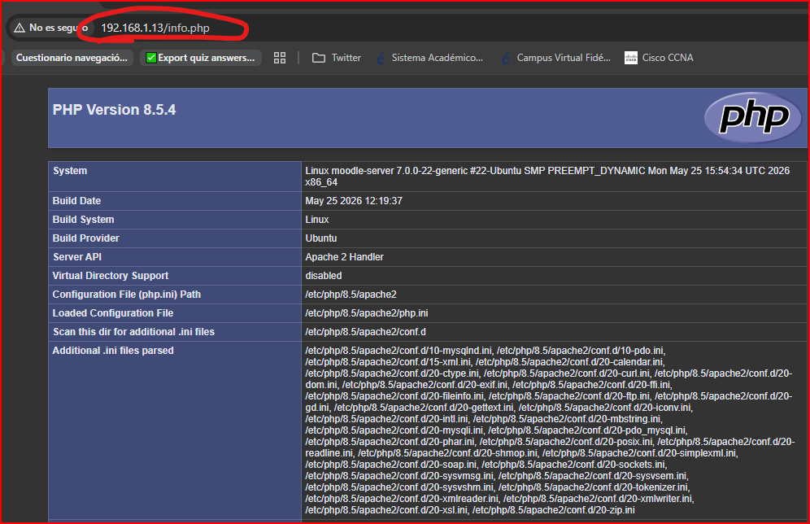

*Figura 5 — Página phpinfo() accesible desde el navegador del equipo anfitrión.*

### Comprobaciones finales

- [x] PHP y todos los módulos requeridos por Moodle instalados.
- [x] OPcache activo verificado con `php -m | grep -i opcache`.
- [x] `php --version` muestra la versión instalada correctamente.
- [x] Apache reiniciado y activo tras la integración con PHP.
- [x] Archivo `info.php` creado en `/var/www/html/`.
- [x] Página `phpinfo()` accesible desde el navegador del anfitrión.
- [x] Archivo `info.php` eliminado tras la validación.

---

## Reto 06 — Implantación y securización inicial de MariaDB

### Introducción

MariaDB será el motor de base de datos que almacenará toda la información del LMS Moodle: usuarios, cursos, calificaciones y contenidos. En este reto instalo el servicio, lo configuro para que arranque automáticamente con el sistema y aplico la securización inicial básica para eliminar configuraciones inseguras por defecto que MariaDB trae al instalarse.

### Objetivos

- Instalar MariaDB en Ubuntu Server.
- Configurar el arranque automático del servicio.
- Ejecutar la securización inicial con `mariadb-secure-installation`.
- Verificar el acceso administrativo al motor de base de datos.

### Material utilizado

| Elemento | Detalle |
|---|---|
| Servidor | Ubuntu Server 22.04 LTS |
| IP del servidor | 192.168.1.13 |
| Motor de base de datos | MariaDB |
| Puerto | 3306 |

### Desarrollo

#### Instalación de MariaDB

Actualizo los repositorios e instalo el servidor MariaDB:

```bash
sudo apt update && sudo apt install mariadb-server -y
```

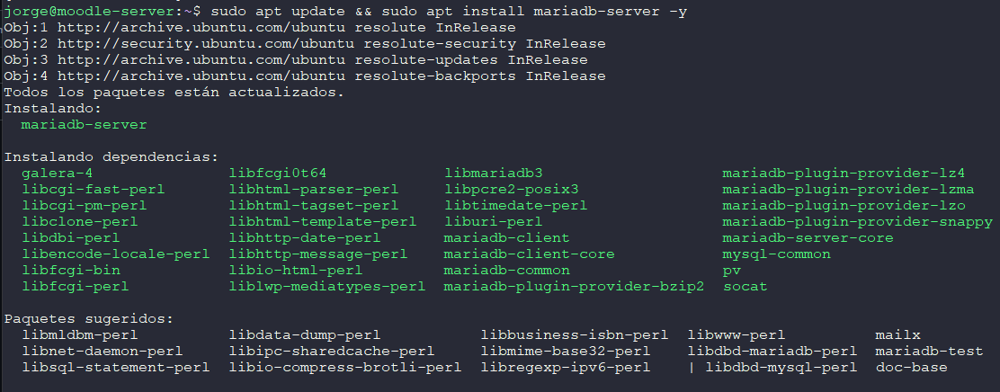

*Figura 1 — Instalación de MariaDB en Ubuntu Server.*

#### Habilitación del arranque automático y verificación del servicio

Configuro MariaDB para que se inicie automáticamente con el sistema y compruebo que está activo:

```bash
sudo systemctl enable mariadb
sudo systemctl status mariadb
```

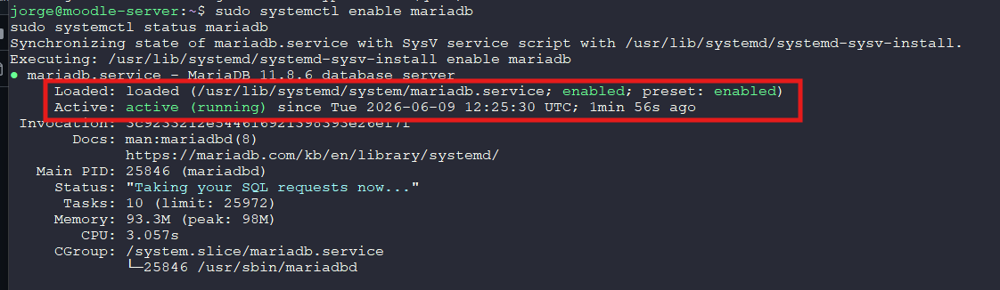

*Figura 2 — Servicio MariaDB activo y configurado para arranque automático.*

#### Securización inicial del servidor MariaDB

Ejecuto el asistente de securización inicial. En versiones modernas de MariaDB el comando correcto es:

```bash
sudo mariadb-secure-installation
```

Durante el proceso aplico las siguientes medidas de seguridad:

| Pregunta | Respuesta aplicada |
|---|---|
| Enter current password for root | `Enter` (sin contraseña por defecto) |
| Switch to unix_socket authentication | `n` |
| Change the root password | `y` → contraseña segura configurada |
| Remove anonymous users | `y` |
| Disallow root login remotely | `y` |
| Remove test database and access to it | `y` |
| Reload privilege tables now | `y` |

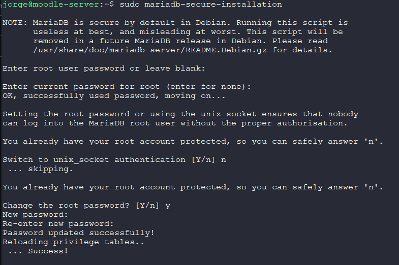

*Figura 3 — Ejecución del proceso de securización inicial de MariaDB.*

#### Verificación del acceso administrativo

Accedo al motor de base de datos con el usuario root para confirmar que la autenticación funciona correctamente:

```bash
sudo mysql -u root -p
```

Una vez dentro, ejecuto una consulta básica para verificar el estado del sistema:

```sql
SHOW DATABASES;
```

La base de datos `test` no aparece en el listado, confirmando que la securización se aplicó correctamente. Salgo del entorno:

```sql
EXIT;
```

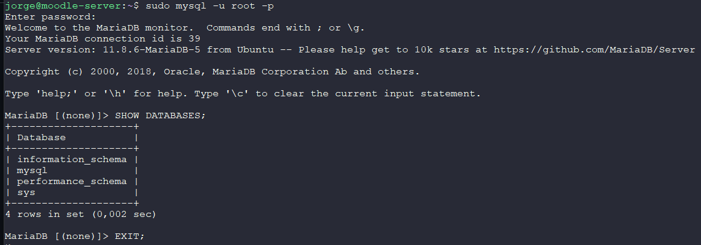

*Figura 4 — Acceso administrativo a MariaDB y verificación de bases de datos.*

#### Validaciones adicionales del servicio

Verifico que MariaDB está escuchando en el puerto correcto y compruebo la versión instalada:

```bash
sudo ss -tlnp | grep 3306
mysql --version
```

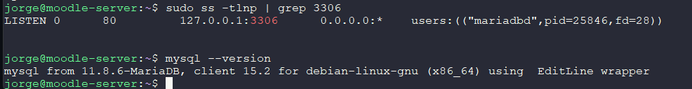

*Figura 5 — Validación del puerto 3306 y versión de MariaDB instalada.*

### Comprobaciones finales

- [x] MariaDB instalado correctamente.
- [x] Servicio activo y configurado para arranque automático.
- [x] `mariadb-secure-installation` ejecutado con todas las medidas aplicadas.
- [x] Contraseña de root configurada.
- [x] Usuarios anónimos eliminados.
- [x] Acceso root remoto desactivado.
- [x] Base de datos `test` eliminada.
- [x] Acceso administrativo verificado con `SHOW DATABASES;`.
- [x] Puerto 3306 activo y escuchando correctamente.

---
## Reto 07 — Creación y configuración de la base de datos corporativa del LMS

### Introducción

Con MariaDB instalado y securizado, el siguiente paso es preparar la estructura SQL que utilizará Moodle. En lugar de usar la cuenta root para la aplicación, creo un usuario dedicado `moodle_user` con permisos únicamente sobre la base de datos `moodle_db`. Esta práctica sigue el principio de mínimo privilegio y es fundamental en cualquier entorno de administración profesional.

### Objetivos

- Crear la base de datos `moodle_db` en MariaDB.
- Crear el usuario `moodle_user` con contraseña segura.
- Asignar permisos exclusivos sobre `moodle_db`.
- Verificar que el usuario puede autenticarse y acceder correctamente.

### Material utilizado

| Elemento | Detalle |
|---|---|
| Servidor | Ubuntu Server 22.04 LTS |
| IP del servidor | 192.168.1.13 |
| Motor de base de datos | MariaDB |
| Base de datos | `moodle_db` |
| Usuario LMS | `moodle_user` |

### Desarrollo

#### Acceso al entorno de administración MariaDB

Accedo al motor de base de datos con el usuario root:

```bash
sudo mysql -u root -p
```

El prompt cambia a `MariaDB [(none)]>`, indicando que estoy dentro del entorno SQL.

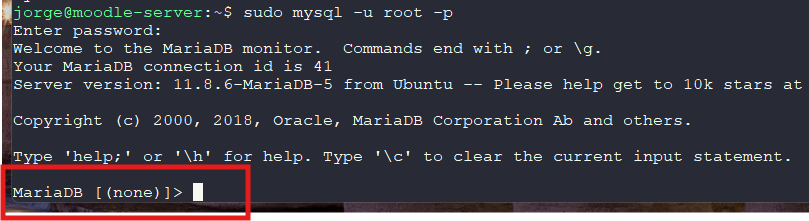

*Figura 1 — Acceso al entorno de administración MariaDB.*

#### Creación de la base de datos

Creo la base de datos con codificación UTF-8 para garantizar compatibilidad completa con Moodle y sus contenidos multilingües:

```sql
CREATE DATABASE moodle_db CHARACTER SET utf8mb4 COLLATE utf8mb4_unicode_ci;
```

Verifico que se ha creado correctamente:

```sql
SHOW DATABASES;
```

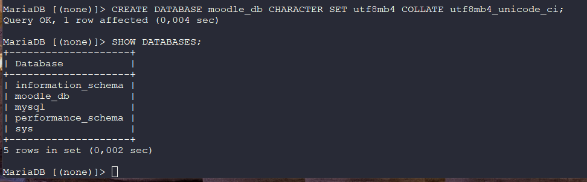

*Figura 2 — Base de datos `moodle_db` creada correctamente.*

#### Creación del usuario exclusivo del LMS y asignación de privilegios

Creo el usuario `moodle_user` con acceso únicamente desde localhost, siguiendo el principio de mínimo privilegio:

```sql
CREATE USER 'moodle_user'@'localhost' IDENTIFIED BY 'TuContraseñaSegura';
```

Asigno todos los permisos necesarios exclusivamente sobre `moodle_db` y actualizo la tabla de privilegios:

```sql
GRANT ALL PRIVILEGES ON moodle_db.* TO 'moodle_user'@'localhost';
FLUSH PRIVILEGES;
```

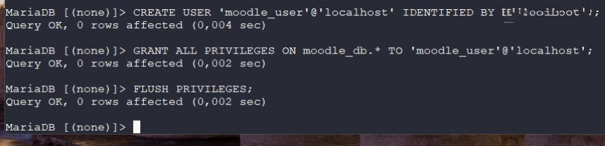

*Figura 3 — Creación de `moodle_user` y asignación de privilegios sobre `moodle_db`.*

#### Verificación de permisos del usuario

Compruebo que los permisos se han asignado correctamente:

```sql
SHOW GRANTS FOR 'moodle_user'@'localhost';
```

La salida muestra `GRANT ALL PRIVILEGES ON moodle_db.*`, confirmando que el usuario solo tiene permisos sobre esa base de datos. Salgo del entorno root:

```sql
EXIT;
```

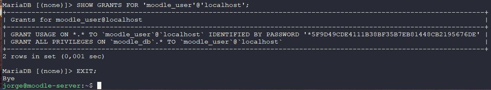

*Figura 4 — Verificación de privilegios del usuario `moodle_user`.*

#### Verificación del acceso con el nuevo usuario

Accedo con las credenciales de `moodle_user` para confirmar que la autenticación funciona correctamente:

```bash
mysql -u moodle_user -p
```

Compruebo que solo tiene visibilidad sobre `moodle_db`:

```sql
SHOW DATABASES;
EXIT;
```

Solo aparecen `moodle_db` e `information_schema`, confirmando que el usuario no tiene acceso a otras bases de datos del sistema.

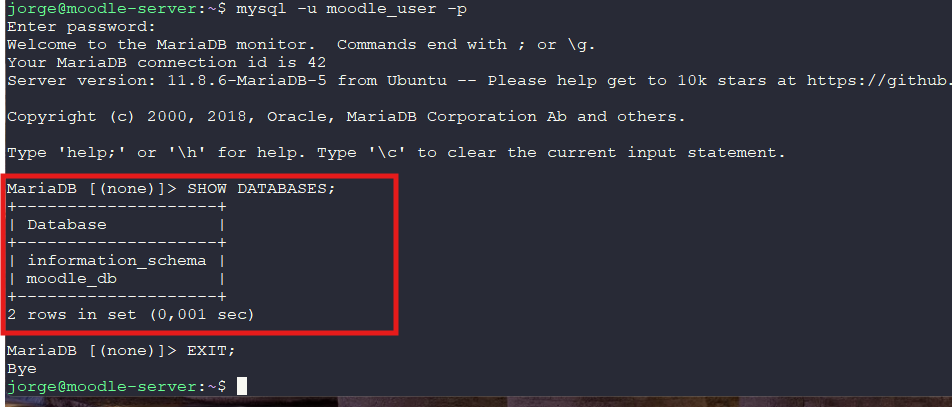

*Figura 5 — Acceso verificado con `moodle_user` y permisos limitados correctamente.*

### Comprobaciones finales

- [x] Base de datos `moodle_db` creada con codificación `utf8mb4`.
- [x] Usuario `moodle_user` creado con acceso solo desde `localhost`.
- [x] Privilegios completos asignados exclusivamente sobre `moodle_db`.
- [x] `FLUSH PRIVILEGES` ejecutado correctamente.
- [x] `SHOW GRANTS` confirma permisos correctos.
- [x] Acceso verificado con `moodle_user` desde terminal.
- [x] `moodle_user` no tiene visibilidad sobre otras bases de datos del sistema.

---
## Reto 08 — Configuración de resolución de nombres local para el LMS corporativo

### Introducción

Hasta ahora el acceso al servidor se realizaba mediante la IP `192.168.1.13`. En este reto configuro el archivo `hosts` del equipo anfitrión Windows para que el nombre `moodle.local` resuelva directamente hacia esa IP sin necesidad de un servidor DNS. Esto permite acceder al LMS de forma más profesional e identificativa dentro de la red corporativa.

### Objetivos

- Identificar la IP estática del servidor Ubuntu.
- Editar el archivo `hosts` del equipo anfitrión Windows.
- Asociar `moodle.local` a la IP `192.168.1.13`.
- Verificar la resolución desde terminal con `ping`.
- Confirmar el acceso web desde el navegador mediante `http://moodle.local`.

### Material utilizado

| Elemento | Detalle |
|---|---|
| Servidor | Ubuntu Server 22.04 LTS |
| IP del servidor | 192.168.1.13 |
| Nombre local corporativo | `moodle.local` |
| Archivo a modificar | `C:\Windows\System32\drivers\etc\hosts` |
| Sistema anfitrión | Windows 10/11 |

### Desarrollo

#### Confirmación de la IP estática del servidor

Desde el servidor verifico que la IP estática sigue correctamente configurada:

```bash
ip a
```

Confirmo que la interfaz `ens33` tiene asignada la IP `192.168.1.13`.

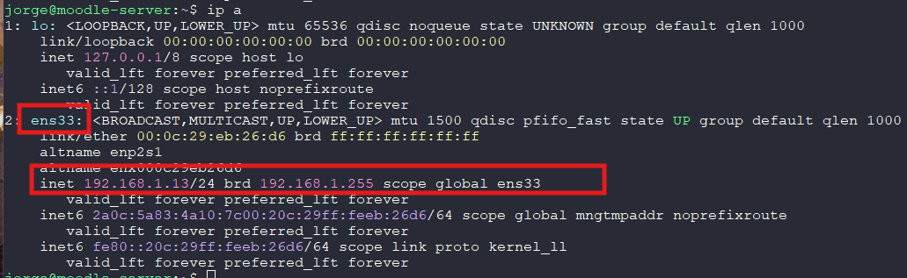

*Figura 1 — IP estática del servidor confirmada.*

#### Edición del archivo hosts en Windows

El archivo `hosts` de Windows permite asociar nombres a IPs de forma local sin necesidad de DNS. Para editarlo abro el **Bloc de notas como administrador**, navego a `C:\Windows\System32\drivers\etc\` y abro el archivo `hosts` seleccionando **Todos los archivos** en el filtro.

Al final del archivo añado la siguiente línea:

```
192.168.1.13    moodle.local
```

Guardo los cambios con `Ctrl + S`.

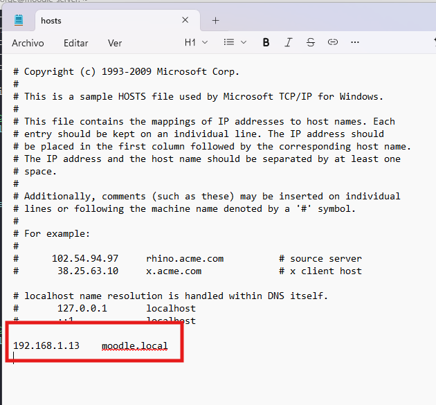

*Figura 2 — Modificación del archivo `hosts` en Windows.*

#### Validación de la resolución desde terminal

Desde CMD o PowerShell del equipo anfitrión verifico que `moodle.local` resuelve correctamente hacia la IP del servidor:

```cmd
ping moodle.local
```

Las respuestas llegan desde `192.168.1.13`, confirmando que la resolución de nombres funciona correctamente.

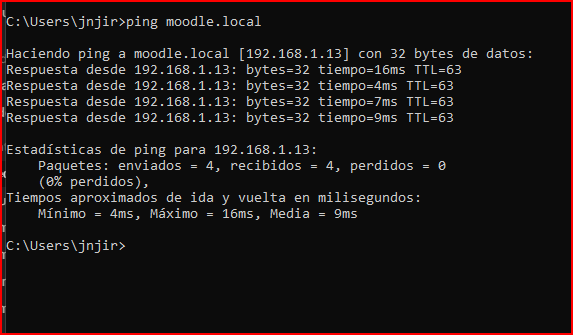

*Figura 3 — Resolución de `moodle.local` verificada desde terminal.*

#### Acceso al servidor desde el navegador mediante nombre local

Desde el equipo anfitrión accedo mediante el navegador a:

```
http://moodle.local
```

Se carga la página por defecto de Apache, confirmando que el servidor responde correctamente mediante el nombre corporativo `moodle.local`.

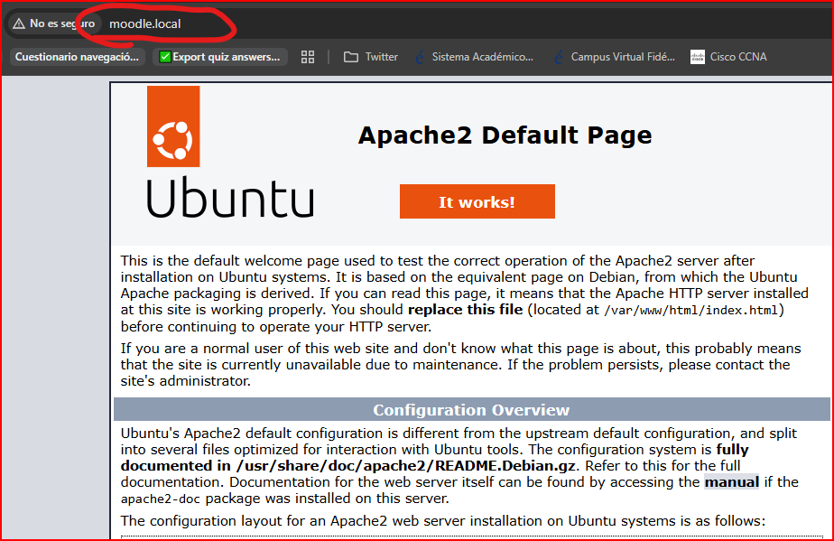

*Figura 4 — Acceso al servidor desde el navegador mediante `moodle.local`.*

### Comprobaciones finales

- [x] IP estática `192.168.1.13` confirmada en el servidor.
- [x] Archivo `hosts` editado con permisos de administrador.
- [x] Línea `192.168.1.13 moodle.local` añadida correctamente.
- [x] `ping moodle.local` responde desde `192.168.1.13`.
- [x] Acceso web correcto desde el navegador mediante `http://moodle.local`.

---
## Reto 09 — Despliegue y preparación de la estructura del LMS corporativo

### Introducción

Con toda la infraestructura base operativa, en este reto descargo el código fuente de Moodle y preparo manualmente la estructura de directorios que la plataforma necesita para funcionar. Moodle separa intencionalmente el código web público del directorio de datos interno por razones de seguridad: `/var/www/moodle` será accesible desde Apache, mientras que `/var/moodledata` almacenará archivos internos fuera del alcance público del servidor web.

### Objetivos

- Descargar la versión estable de Moodle desde terminal.
- Crear y organizar la estructura de directorios del LMS.
- Configurar permisos y propietarios correctos para Apache.
- Crear un VirtualHost en Apache para `moodle.local`.
- Verificar desde el navegador que aparece el instalador inicial de Moodle.

### Material utilizado

| Elemento | Detalle |
|---|---|
| Servidor | Ubuntu Server 22.04 LTS |
| IP del servidor | 192.168.1.13 |
| Nombre local | `moodle.local` |
| Plataforma LMS | Moodle 4.x (versión estable) |
| Directorio web | `/var/www/moodle` |
| Directorio de datos | `/var/moodledata` |

### Desarrollo

#### Descarga del código fuente de Moodle

Descargo la última versión estable de Moodle directamente desde terminal usando `wget`:

```bash
cd /tmp
wget https://download.moodle.org/download.php/direct/stable405/moodle-latest-405.tgz
```

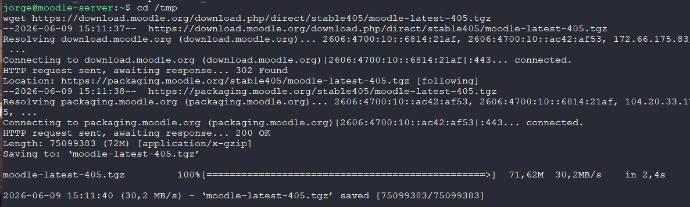

*Figura 1 — Descarga del código fuente de Moodle desde terminal.*

#### Descompresión del paquete

Descomprimo el archivo descargado en `/tmp` y verifico que se ha creado la carpeta `moodle`:

```bash
tar -xvzf moodle-latest-405.tgz
ls /tmp/moodle
```

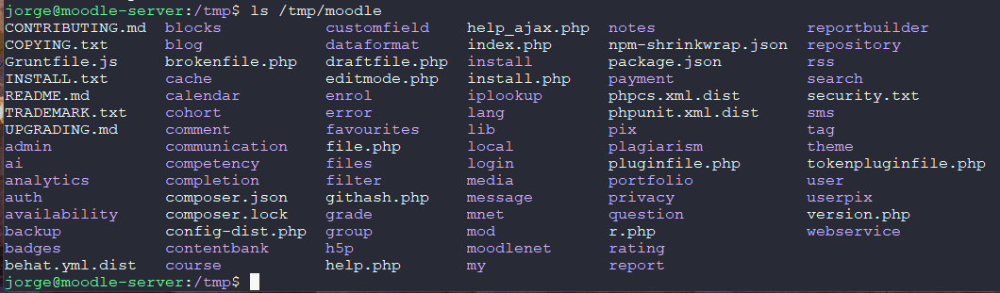

*Figura 2 — Descompresión del paquete de Moodle.*

#### Creación de la estructura de directorios y movimiento del código fuente

Creo el directorio web donde se alojará el código fuente y el directorio de almacenamiento interno fuera del directorio web público:

```bash
sudo mkdir -p /var/www/moodle
sudo mkdir -p /var/moodledata
```

Muevo el contenido descomprimido al directorio web de Apache y verifico la estructura final:

```bash
sudo mv /tmp/moodle/* /var/www/moodle/
ls /var/www/
ls /var/
```

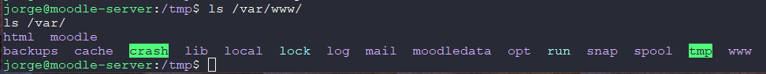

*Figura 3 — Estructura de directorios del LMS creada correctamente.*

#### Configuración de permisos y propietarios

Asigno el propietario `www-data` (usuario de Apache) a ambos directorios y aplico los permisos adecuados:

```bash
sudo chown -R www-data:www-data /var/www/moodle
sudo chown -R www-data:www-data /var/moodledata
sudo chmod -R 755 /var/www/moodle
sudo chmod -R 770 /var/moodledata
```

Verifico que los permisos se han aplicado correctamente:

```bash
ls -ld /var/www/moodle
ls -ld /var/moodledata
```

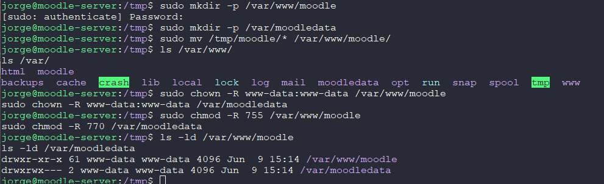

*Figura 4 — Permisos y propietarios aplicados sobre los directorios del LMS.*

#### Configuración del VirtualHost de Apache para moodle.local

Creo un VirtualHost específico para que Apache sirva Moodle bajo el nombre `moodle.local`:

```bash
sudo nano /etc/apache2/sites-available/moodle.conf
```

```apache
<VirtualHost *:80>
    ServerName moodle.local
    DocumentRoot /var/www/moodle

    <Directory /var/www/moodle>
        Options FollowSymLinks
        AllowOverride All
        Require all granted
    </Directory>

    ErrorLog ${APACHE_LOG_DIR}/moodle_error.log
    CustomLog ${APACHE_LOG_DIR}/moodle_access.log combined

    php_flag display_errors Off
    php_value error_reporting 0
</VirtualHost>
```

Habilito el sitio y el módulo `rewrite`, y reinicio Apache:

```bash
sudo a2ensite moodle.conf
sudo a2enmod rewrite
sudo systemctl restart apache2
```

#### Verificación del instalador de Moodle desde el navegador

Desde el equipo anfitrión accedo mediante el navegador a:

```
http://moodle.local
```

Se carga la pantalla inicial del instalador web de Moodle con el selector de idioma visible, confirmando que Apache sirve correctamente el LMS desde `/var/www/moodle`. En esta fase no se completa el asistente de instalación.

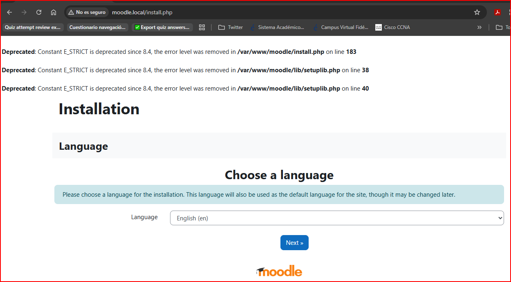

*Figura 5 — Instalador inicial de Moodle accesible desde el navegador.*

#### Seguridad: separación entre código fuente y datos internos

Moodle separa el código fuente de los datos internos por razones de seguridad. El directorio `/var/moodledata` almacena archivos subidos por usuarios, caché, sesiones y datos de cursos. Al situarlo fuera del directorio público de Apache, solo la propia aplicación puede acceder a él mediante el sistema de archivos del servidor. Si estuviera dentro de `/var/www/moodle`, cualquier usuario podría acceder a esos archivos directamente desde el navegador, exponiendo datos privados y comprometiendo la seguridad del sistema.

### Comprobaciones finales

- [x] Moodle descargado y descomprimido correctamente.
- [x] Directorio `/var/www/moodle` creado con el código fuente en su interior.
- [x] Directorio `/var/moodledata` creado fuera del directorio web público.
- [x] Propietario `www-data` asignado a ambos directorios.
- [x] Permisos `755` en `/var/www/moodle` y `770` en `/var/moodledata`.
- [x] VirtualHost `moodle.conf` creado y habilitado en Apache.
- [x] Módulo `rewrite` habilitado.
- [x] Pantalla del instalador de Moodle visible desde `http://moodle.local`.

---
## Reto 10 — Instalación lógica y configuración inicial de Moodle

### Introducción

Con la estructura de directorios preparada y la base de datos lista, en este reto completo el asistente web de instalación de Moodle. La plataforma se conecta con MariaDB, genera automáticamente todas las tablas internas necesarias y queda completamente operativa con una cuenta administradora funcional lista para gestionar el LMS corporativo.

### Objetivos

- Completar el asistente web de instalación de Moodle.
- Configurar correctamente las rutas del LMS y la conexión con MariaDB.
- Validar que todos los requisitos del sistema están cubiertos.
- Crear la cuenta administradora principal del LMS.
- Verificar el acceso al panel principal de Moodle.

### Material utilizado

| Elemento | Detalle |
|---|---|
| Servidor | Ubuntu Server 22.04 LTS |
| URL del LMS | `http://moodle.local` |
| Base de datos | `moodle_db` |
| Usuario SQL | `moodle_user` |
| Directorio de datos | `/var/moodledata` |
| Versión Moodle | 4.5.11+ (Build: 20260604) |
| Acceso desde | Navegador del equipo anfitrión |

### Desarrollo

#### Acceso al instalador web de Moodle

Desde el navegador del equipo anfitrión accedo a `http://moodle.local`. Se carga el asistente de instalación, selecciono el idioma y hago clic en **Next**.

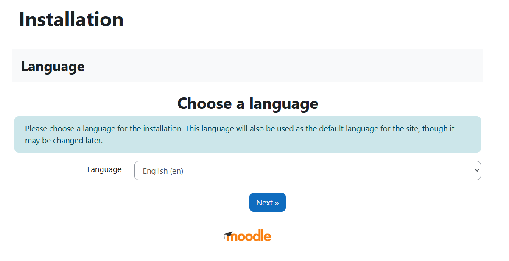

*Figura 1 — Inicio del instalador web de Moodle.*

#### Configuración de la conexión con MariaDB

El instalador solicita los parámetros de conexión con la base de datos. Selecciono el driver **Improved MySQL (native/mysqli)**, compatible con MariaDB, e introduzco los datos de conexión:

| Campo | Valor |
|---|---|
| Database host | `localhost` |
| Database name | `moodle_db` |
| Database user | `moodle_user` |
| Tables prefix | `mdl_` |
| Database port | *(vacío)* |
| Unix socket | *(vacío)* |

Una vez configurada la conexión, edito el archivo `config.php` generado por el instalador para corregir el driver a `mariadb`:

```bash
sudo nano /var/www/moodle/config.php
```

```php
$CFG->dbtype = 'mariadb';
```

#### Validación de requisitos del sistema

El instalador verifica que todos los componentes necesarios están disponibles. Se resuelven los siguientes puntos antes de continuar:

- `max_input_vars` aumentado a 5000 en `/etc/php/8.5/apache2/php.ini`.
- Restricción de versión PHP eliminada en `/var/www/moodle/admin/environment.xml` para compatibilidad con PHP 8.5.
- Driver de base de datos corregido a `mariadb` en `config.php`.

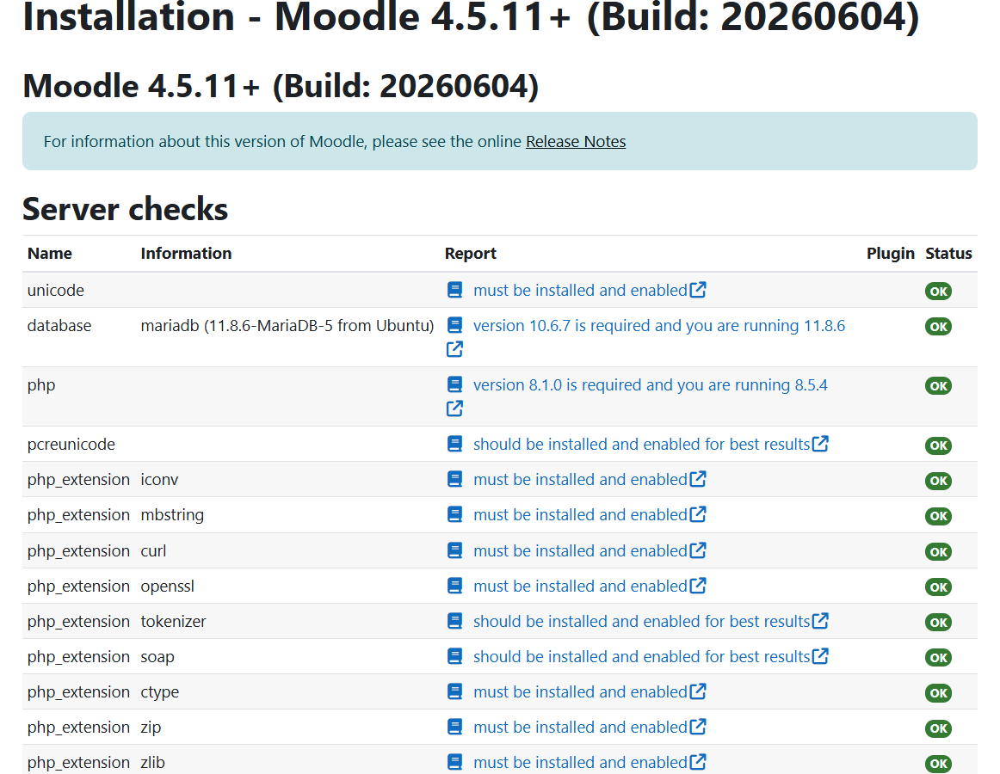

*Figura 3 — Validación de requisitos del sistema.*

#### Instalación automática de tablas y componentes internos

El instalador genera automáticamente todas las tablas internas de Moodle en `moodle_db`. El proceso ejecuta cientos de operaciones SQL. Al finalizar aparece el log completo con el botón **Continue**.

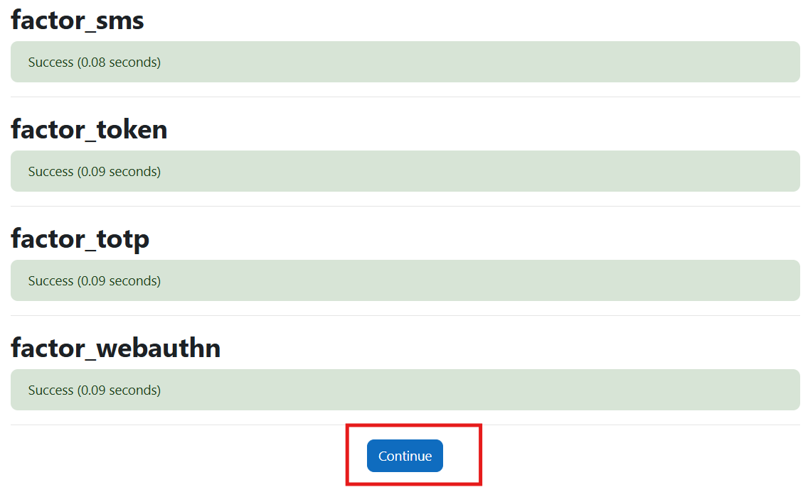

*Figura 4 — Instalación de tablas y componentes internos completada.*

#### Creación de la cuenta administradora

El instalador solicita los datos de la cuenta administradora principal del LMS:

| Campo | Valor |
|---|---|
| Username | `admin` |
| First name | `Admin` |
| Surname | `CodeArts` |
| Country | Spain |

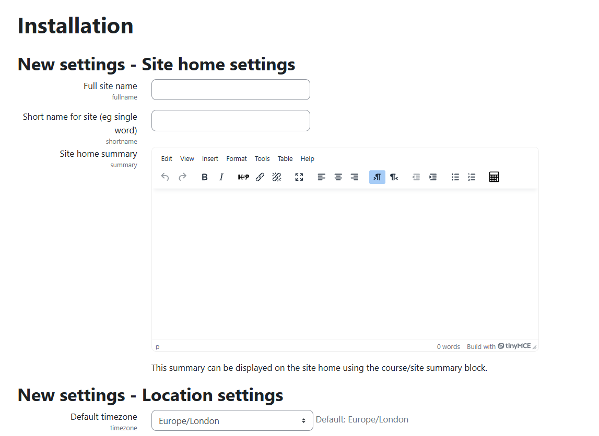

*Figura 5 — Creación de la cuenta administradora del LMS.*

#### Acceso al panel principal de Moodle

Tras completar la configuración básica del sitio con el nombre `CodeArts Solutions LMS`, Moodle finaliza la instalación y redirige automáticamente al panel principal, confirmando que la plataforma está completamente operativa.

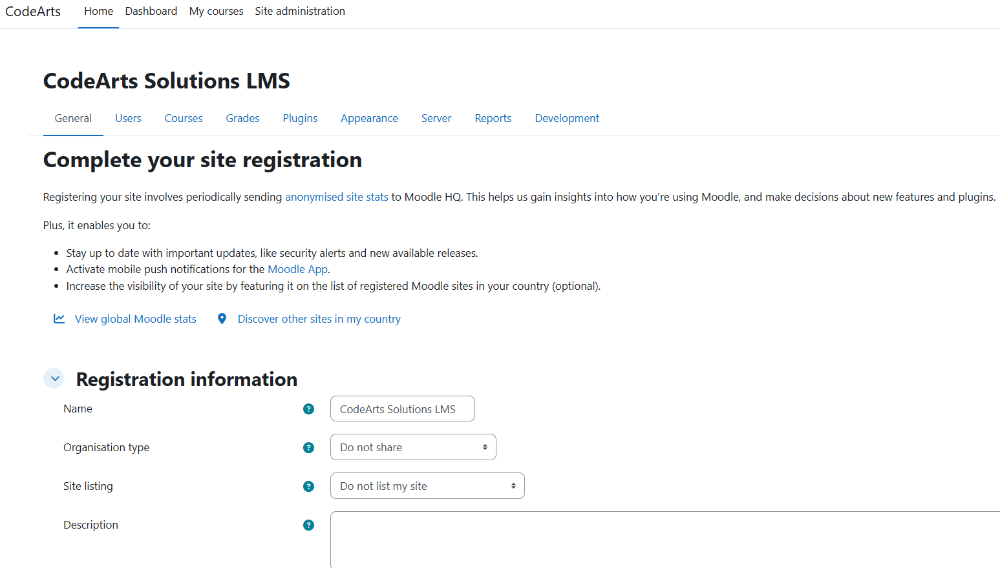

*Figura 6 — Panel principal de Moodle operativo tras la instalación.*

### Comprobaciones finales

- [x] Instalador web completado sin errores críticos.
- [x] Rutas del LMS configuradas correctamente.
- [x] Driver de base de datos corregido a `mariadb` en `config.php`.
- [x] `max_input_vars` configurado a 5000.
- [x] Conexión con MariaDB establecida con `moodle_user` y `moodle_db`.
- [x] Tablas internas de Moodle generadas correctamente.
- [x] Cuenta administradora creada y funcional.
- [x] Panel principal de Moodle accesible desde `http://moodle.local`.

---
## Reto 11 — Administración inicial y configuración corporativa del LMS

### Introducción

Con Moodle instalado y operativo, en este reto realizo la configuración administrativa base de la plataforma para adaptarla al entorno corporativo de CodeArts Solutions. Configuro el nombre del sitio, el idioma principal, la zona horaria y la portada, dejando el LMS listo para comenzar la gestión de usuarios y contenidos en los retos siguientes.

### Objetivos

- Acceder al panel de administración de Moodle.
- Configurar el nombre completo y corto del sitio.
- Establecer el idioma principal en Español Internacional.
- Configurar la zona horaria del servidor.
- Personalizar la portada del LMS.

### Material utilizado

| Elemento | Detalle |
|---|---|
| URL del LMS | `http://moodle.local` |
| Nombre del sitio | `CodeArts LMS` |
| Nombre corto | `CodeArts` |
| Idioma principal | Español - Internacional |
| Zona horaria | Europe/Madrid |

### Desarrollo

#### Acceso al panel de administración

Accedo a `http://moodle.local` e inicio sesión con la cuenta administradora. Desde el menú superior accedo a **Administración del sitio** donde se muestran todas las secciones de configuración: General, Users, Courses, Grades, Plugins, Appearance, Server, Reports y Development.

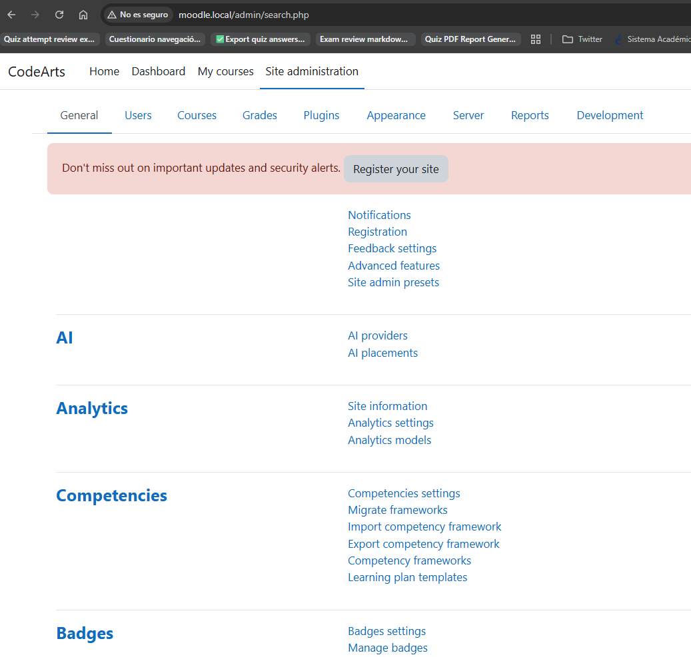

*Figura 1 — Panel principal de administración de Moodle.*

#### Configuración del nombre del sitio e idioma principal

Desde **Administración del sitio → General → Ajustes generales** configuro los campos obligatorios del proyecto:

| Campo | Valor |
|---|---|
| Nombre completo del sitio | `CodeArts LMS` |
| Nombre corto del sitio | `CodeArts` |
| Idioma por defecto | `Español - Internacional (es)` |
| Zona horaria por defecto | `Europe/Madrid` |

Guardo los cambios con **Guardar cambios**.

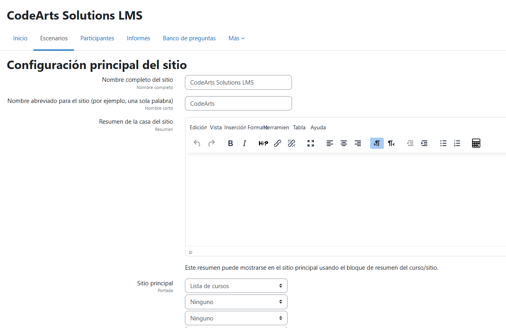

*Figura 2 — Nombre del sitio e idioma configurados en los ajustes generales.*

#### Instalación del paquete de idioma español

Accedo a **Administración del sitio → Idioma → Paquetes de idioma**, selecciono **Español - Internacional (es)** y hago clic en **Instalar paquetes de idioma seleccionados**. Tras la instalación lo establezco como idioma por defecto en los ajustes generales.

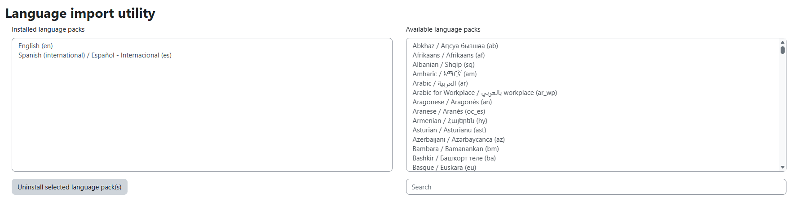

*Figura 3 — Configuración del idioma principal del LMS.*

#### Revisión de ajustes generales del LMS

Desde **Administración del sitio → General → Ajustes generales** reviso y configuro los parámetros regionales del entorno corporativo:

- **Zona horaria del servidor:** `Europe/Madrid`
- **País por defecto:** `Spain`
- **Resumen del sitio:** `Plataforma de formación interna de CodeArts Solutions`

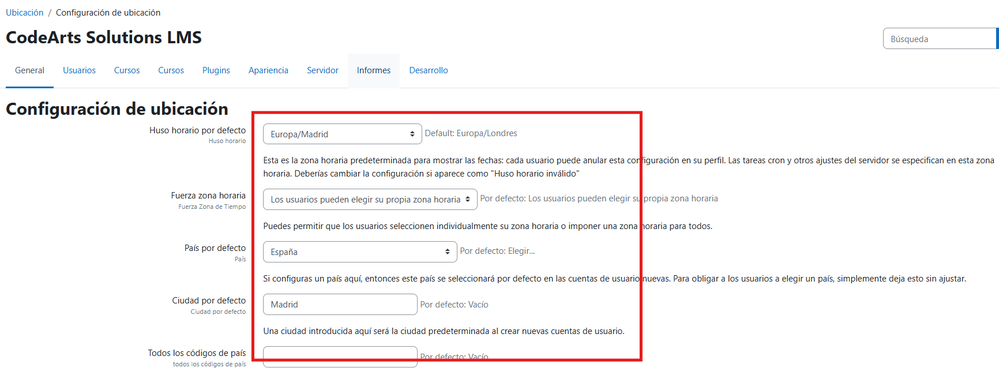

*Figura 4 — Ajustes generales del LMS configurados.*

#### Personalización de la portada

Accedo a **Administración del sitio → Portada → Ajustes de la portada** y configuro la descripción corporativa del LMS. Verifico que la portada se muestra correctamente navegando a `http://moodle.local`.

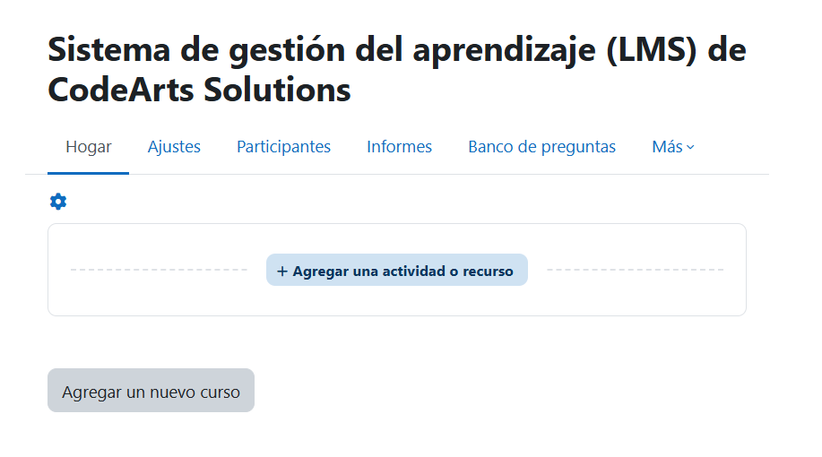

*Figura 5 — Portada del LMS personalizada.*

### Comprobaciones finales

- [x] Acceso al panel de administración sin errores.
- [x] Nombre del sitio configurado como `CodeArts LMS` / `CodeArts`.
- [x] Idioma principal establecido en Español Internacional.
- [x] Zona horaria configurada como `Europe/Madrid`.
- [x] País por defecto establecido como Spain.
- [x] Portada del LMS personalizada y visible.

---

## Reto 12 — Gestión corporativa de usuarios, roles y permisos en Moodle

> ⏳ *Pendiente de realización.*

---

## Reto 13 — Creación y organización del entorno formativo corporativo

> ⏳ *Pendiente de realización.*

---

## Reto 14 — Hardening y buenas prácticas básicas de seguridad del servidor LMS

> ⏳ *Pendiente de realización.*

---

## Reto 15 — Implementación de estrategia básica de copias de seguridad del LMS corporativo

> ⏳ *Pendiente de realización.*
